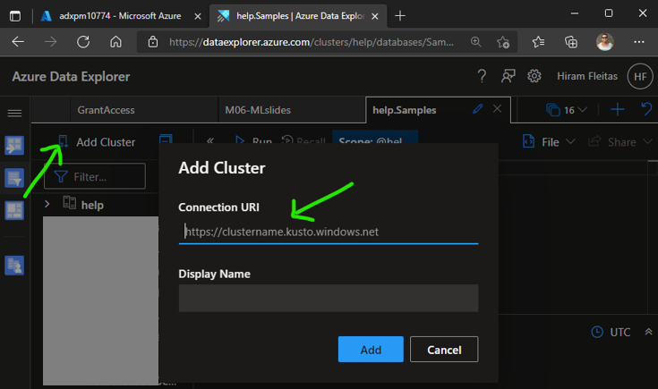

## 🧪 ADX for IoT Analytics (Hands-On Lab)
Azure Data Explorer can provide valuable insights into your IoT workloads. In the following lab, we look at thermostat IoT Devices that are in 3 different office buildings.

## Prerequisites
- An [Azure account](https://azure.microsoft.com/free) with an active subscription. If you don't have access to an Azure subscription, you may be able to start with a [free account](https://azure.com/free).
- You must have the necessary privileges within your Azure subscription to create resources, perform role assignments, register resource providers (if required), etc.

The instructions will deploy the following:
- IoT Central Store Analytics Template 
  - 36 thermostat devices being created and simulated
  - Setup Export to Event Hub of telemetry data
- Event Hub 
  - Data exported from IoT Central
  - ADX Data Connection to ingest data
- Azure Digital Twins
  - Office, Floors, and Thermostat twins
  - Atlanta, Dallas, Seattle offices with 6 Floors in each
  - 36 Thermostat twins created spread across the 3 offices with 2 on each floor
- Azure Data Explorer
  - StageIoTRaw table where data lands from Event Hub to get new data
  - Thermastat table with update policy to transform raw data
  - Historical data from January 2022 loaded into Thermostat table
  - Two functions
    - GetDevicesbyOffice: query ADT by Office names to get all DeviceIds at the office
    - GetDevicesbyOfficeFloor: query ADT by Office and Floor to get all Devices on that floor 

## ⭐ Instructions for Lab Deployment 

Open [Azure Cloud Shell](https://shell.azure.com/) and run the following commands:
1. Login to Azure
    ```bash
    az login
    ```

2. If you have more than one subscription, select the appropriate one:
    ```bash
    az account set --subscription "<your-subscription>"
    ```

3. Get the latest version of the repository
    ```bash
    git clone https://github.com/Azure/ADXIoTAnalytics.git
    ```

4. Deploy solution
    ```bash
    cd ADXIoTAnalytics
    . ./deploy.sh
    ```
    

5. After deploy script completes:
    - Go to **Home** > **[Azure Data Explorer Clusters](https://portal.azure.com/#blade/HubsExtension/BrowseResource/resourceType/Microsoft.Kusto%2Fclusters)** > click on the newly deployed **ADX cluster** > copy the **URI** and open it in a new tab. 
    - Alternatively, **[ADX Web-UI](https://aka.ms/adx.try)** > click **Add Cluster** > enter your **Connection URI** > click **Add**.
     
    
    
    
     
7. Expand Database > IoTAnalytics 

    
    
9. Run KQL queries in [sample.kql](kqlsample/sample.kql) to get you started exploring in ADX.

    

## 🏢 Lab Architecture


## 🧬 Files used in the solution

- **asssets folder**: contains the following files:
  - AutomationPresentation.gif: quick explanation of the solution
  - Connected_Devices.pbix : sample report to visualize the data

- **config folder**: contains the configDB.kql that includes the code required to create the Azure Data Explorer tables and functions

- **dtconfig folder**: contains the files necessary to configure the Azure Digital Twins service:
  - Floor.json
  - Office.json
  - Thermostat.json

- **modules folder**: contains the [Azure Bicep](https://docs.microsoft.com/EN-US/azure/azure-resource-manager/bicep/) necessary to deploy and configure the resource resources used in the solution:
  - adx.bicep: ADX Bicep deployment file
  - digitaltwin.bicep: Digital Twin Bicep deployment file
  - eventhub.bicep: Event Hub Bicep deployment file
  - iotcentral.bicep: IoT Central Bicep deployment file
  - storage.bicep: Storage Bicep deployment file. This account is used as temporary storage to download ADX database configuration scripts)

- deploy.sh: script to deploy the solution. THe only one you need to run 
- main.bicep: main Bicep deployment file. It includes all the other Bicep deployment files (modules)
- patientmonitoring.parameters.json: parameters file used to customize the deployment
- README.md: This README file

## Authors
- Brad Watts (ADX - Senior Program Manager) 
- Tonio Lora (Director Specialist GBB)
- Hiram Fleitas (Data & AI - Senior Customer Engineer)

## Contributing

This project welcomes contributions and suggestions.  Most contributions require you to agree to a
Contributor License Agreement (CLA) declaring that you have the right to, and actually do, grant us
the rights to use your contribution. For details, visit https://cla.opensource.microsoft.com.

When you submit a pull request, a CLA bot will automatically determine whether you need to provide
a CLA and decorate the PR appropriately (e.g., status check, comment). Simply follow the instructions
provided by the bot. You will only need to do this once across all repos using our CLA.

This project has adopted the [Microsoft Open Source Code of Conduct](https://opensource.microsoft.com/codeofconduct/).
For more information see the [Code of Conduct FAQ](https://opensource.microsoft.com/codeofconduct/faq/) or
contact [opencode@microsoft.com](mailto:opencode@microsoft.com) with any additional questions or comments.

## Trademarks

This project may contain trademarks or logos for projects, products, or services. Authorized use of Microsoft 
trademarks or logos is subject to and must follow 
[Microsoft's Trademark & Brand Guidelines](https://www.microsoft.com/en-us/legal/intellectualproperty/trademarks/usage/general).
Use of Microsoft trademarks or logos in modified versions of this project must not cause confusion or imply Microsoft sponsorship.
Any use of third-party trademarks or logos are subject to those third-party's policies.
